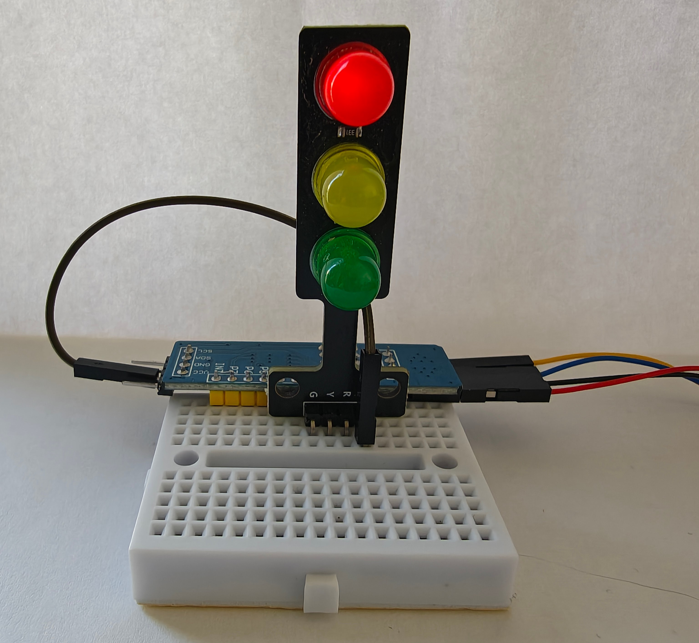

# IO Expander Traffic Lights

At some point, GPIO pins might become a tight resource -- or you might want to control 
multiple IO pins at a longer distance -- without pulling a massive amount of wires.

In these situations, you might want to consider using a so-called "IO Expander".

IO Expanders provide multiple GPIO pins (typically 8 or 16) and can be controlled by the I2C protocol.

To illustrate the usage of IO Expanders with Pi4j, here, we implement a simple "traffic light" connected to the
Raspberry PI via I2C using a PCF8574 8 bit IO Expander. 

## The TrafficLight class

We start by implementing a simple Traffic Light class. This might seem like a trivial
abstraction initially, but having something that ensures that we don't show red and green lights
at the same time might not be such a silly idea at all.

One important detail here is that we use the OnOffWrite interface to represent the lights. 
OnOffWrite is an interface implemented by DigitalInput that abstracts from physical aspects
souch as debounce settings and just encapsulates the on/off state. Using this abstraction
will make our traffic lights work seamlessly with IO Expanders and physial Rasperry PI GPIO pins
all the like:

```
public class TrafficLight {
    // OnOffWrite is a simple interface implemented by DigitalOutput that abstracts from some physical aspects 
    private final OnOffWrite red;
    private final OnOffWrite yellow;
    private final OnOffWrite green;
```

We also need a simple constructor to create a traffic light instance:

```
    public TrafficLight(OnOffWrite red, OnOffWrite yellow, OnOffWrite green) {
        this.red = red;
        this.yellow = yellow;
        this.green = green;
    }
```

Next, we model the four "legal" states of our traffic light in a "State" class:

```
    enum State {
        RED, RED_YELLOW, GREEN, YELLOW;
    }
```

Finally, we map these states to the corresponding lights:

```
    public void setState(State state) {
        red.setState(state == State.RED || state == State.RED_YELLOW);
        yellow.setState(state == State.YELLOW || state == State.RED_YELLOW);
        green.setState(state == State.GREEN);
    }
}
```

## The Hardware Setup

When testing this example, we were using a cheap "ready-made" traffic light built from 3 LEDs and corresponding
resistors, as shown in the photo. However, the same works just with plain LEDs and resistors. 



The general hardware setup is as follows:

- Connect VCC, SDA, SCL, GND of the IO Expander to the corresponding pins 1, 3, 5 and 9 of your Rasperry PI
  - Using the Qwiic wiring system might be generally useful when working with I2C to avoid wiring mistakes
- Connect the Red, Green and Yellow LEDs and the protective resistor to output pins 0, 1, and 2 on the IO Expander and ground.
- To match the example, the PCF8574 I2C address needs to be configured to the default (0x20)
  - Of course, the address can be changed easily -- use `i2cdetect -y 1` for a quick sanity check.

## The Main Code

Now all we need is a small program tying this all together.

We start with the general Pi4J setup that we will always need:

```
public class Main {

    static void main() {
        Context pi4j = Pi4J.newAutoContext();
```

Next, we set up the IO expander from the drivers repository on bus1, address 20:

```
        OutputExpander outputExpander = new Pcf8574OutputDriver(
            pi4j.create(I2CConfig.newBuilder(pi4j).bus(1).device(0x20)));
```

Then we create a TrafficLight instance, connected to pins 0-2 of the expander:

```
        TrafficLight trafficLight = new TrafficLight(
            /* red */ outputExpander.getOutput(0),
            /* yellow */ outputExpander.getOutput(1),
            /* green */ outputExpander.getOutput(2));
```

Finally, we add a loop cycling through the valid states -- with some delay
between the states.

```
        Delay delay = new Delay();
        // Cycle through the 4 states forever.
        while (true) {
            trafficLight.setState(TrafficLight.State.RED);
            delay.setMillis(2000).materialize();
            trafficLight.setState(TrafficLight.State.RED_YELLOW);
            delay.setMillis(1000).materialize();
            trafficLight.setState(TrafficLight.State.GREEN);
            delay.setMillis(2000).materialize();
            trafficLight.setState(TrafficLight.State.YELLOW);
            delay.setMillis(1000).materialize();
        }
}
```

We have left out the imports for readability, but the full working example
can be found in this directory; the left sidebar on github should show 
all the files.

That's all -- your I2C traffic light should be ready to roll!

## Expansion Ideas

If you enjoyed this example, consider trying the following:

- Build another traffic light and expand the code so they show 
  the opposite signal, like a set of real traffic signals would;
  this can be done with more IO Expanders or by utilizing more pins.

- Implement an error state that shows a yellow blinking signal
